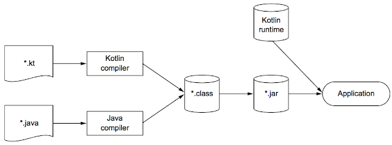
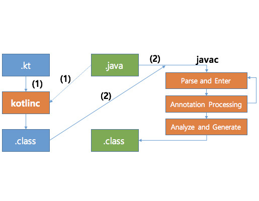

# 코틀린이란 무엇이며, 왜 필요한가?
## 1. 코틀린이란?
- 자바가 사용되고 있는 모든 용도에 적합하면서 더 간결하고 생산적이며 안전한 대체 언어입니다.
- 자바와 완벽히 호환되며, 자바가 실행되는 모든 곳에서 사용 가능합니다.

## 2. 주요 특성
### 정적 타입 지정 언어
- 정적 타입(Statically typed) 프로그래밍 언어 : 타입 즉, 자료형을 컴파일 시점에 결정하는 프로그래밍 언어.
- 컴파일 시점에 타입 검사를 수행하여 신뢰성을 높입니다.
- 코틀린 컴파일러가 문맥으로부터 변수 타입을 자동으로 유추 합니다.(타입 추론)
    ```kotlin
    val num = 1 // 타입을 자동 추론 num: int
    ```
- 성능, 신뢰성, 유지보수성에서 이점이 있다.

## 3. 코틀린의 철학
### 1.실용성
- 코틀린은 다른 프로그래밍 언어가 채택한 이미 성공적으로 검증된 해법과 기능에 의존한다
- 언어의 복잡도가 줄어들고 이미 알고 있는 기존 개념을 통해 코틀린을 더 쉽게 배울 수 있다.
- 자바 스타일을 그대로 사용하면서 코틀린의 강력한 기능을 추가할 수 있다.
### 2.간결성
- 자바에 존재하는 여러 가지 번거로운 준비 코드를 코틀린은 묵시적으로 제공한다.
    ```kotlin
    // Java 코드
    public class Person {
        private String name;
        private int age;
    
        public Person(String name, int age) {
            this.name = name;
            this.age = age;
        }
    
        public String getName() {
            return name;
        }
    
        public int getAge() {
            return age;
        }
    }
    
    // Kotlin 코드
    data class Person(
        val name: String,
        val age: Int
    )
    ```
### 3.안정성
- 코틀린은 JVM에서 실행 되므로 안정성이 보장된다.
- JVM을 사용하면 메모리 안정성 보장, 버퍼 오버플로를 방지, 동적으로 할당한 메모리를 잘못 사용함으로써 발생할 수 있는 다양한 문제 예방할 수 있다.
- NullPointerException 방지 등 타입 안정성을 제공하여 실행 오류를 줄인다.
    ```kotlin
        //널이 될 수 있는지 여부를 표시하기 위해서는 ? 만 추가하면 된다.
        val s: String? = null //<- 널이 될 수 있음 ⭕️
        val s2: String = ""   //<- 널이 될 수 없음 ❌
        
    ```
### 4.상호운용성
- 기존 자바 라이브러리와 **완벽히** 호환된다.
- 자바 코드에서 코틀린을 호출하거나 그 반대도 가능하다.

# 4. 컴파일
## 코틀린 빌드 과정

- 코틀린 컴파일러로 컴파일한 코드는 코틀린 런타임 라이브러리에 의존한다.
- 프로젝트를 컴파일하기 위해 메이븐, 그레이들, 앤트 등의 빌드 시스템을 사용할 것 이다.
## 코틀린과 자바가 함께 있을 때 컴파일 과정

- 코틀린 컴파일러가 코틀린코드를 컴파일해 바이트 코드 (.class)를 생성
- 코틀린코드가 참조하는 자바코드도 함께 로딩되어 사용.
- 자바 컴파일러가 자바코드를 컴파일해 바이트 코드 (.class)를 생성
- 이미 컴파일된 코틀린의 바이트코드 (.class)의 경로를 class path에 추가해 컴파일.
