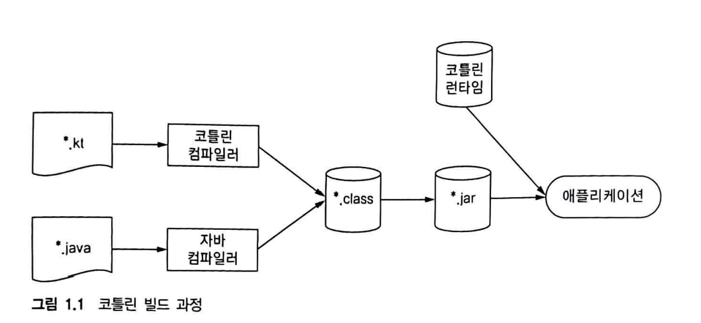

## 코틀린이란 무잇이며 왜 필요한가?

- 코틀린이란? 자바 플랫폼에서 돌아가는 새로운 프로그래밍 언어
- 코틀린은 간결하고 실용적이며, 자바 코드와의 상호윤용성을 중시한다.
- 현재 자바가 사용중인 곳이라면 거의 대부분 코틀린을 활용할 수 있다.

---
## 코틀린의 주요 특성

1. 대상 플랫폼 : 서버, 안드로이드 등 자바가 실행되는 모든 곳 
- 일반적인 영역
  - 서버상의 코드( 특히 웹 애플리케이션의 백엔드(backend))
  - 안드로이드 디바이스에서 실행되는 모바일 애플리케이션
  
- 이외 영역
  - 인텔의 멀티OS 엔진을 사용하면 코틀린을 IOS 디바이스에서 실행 가능
  - 테스크탑 애플리케이션을 작성하고 싶다면 코틀린과 토네이도FX, 자바FX 등을 함께 사용할 수 있다.
  - 자바뿐 아니라 자바스크립트도 코틀린을 컴파일 할 수 있다. 따라서 코틀린 코드를 브라우저나 노드에서 실행할 수 있다.
    
2. 정적 타입 지정 언어
- 자바와 마찬가지로 코틀린도 정적 타입 지정 언어다. 
- 하지만 코틀린은 타입 추론을 지원하기 떄문에 코드를 작성할 때 명시적으로 타입을 지정하지 않아도, 컴파일러가 변수나 표현식의 타입을 추론하여 컴파일 단계에서 타입 검사를 수행한다.
   ```kotlin
   val number = 10       // Int로 추론
   val message = "Hello" // String으로 추론
   ```
3. 함수형 프로그래밍과 객체지향 프로그래밍 
- 코틀린은 객체지향 프로그래밍(OOP)과 함수형 프로그래밍(FP)를 모두 지원하는 멀티패러다임 언어다.
- 객체지향 프로그래밍 측면
  - 클래스와 객체
  - 캡슐화
  - 상송
  - 다형성
- 함수형 프로그래밍 측면
  - 일급 시민인 함수
    - 함수는 변수에 할당하거나, 다른 함수의 파라미터로 전달하거나, 반환값으로 사용할 수 있다.
    ```kotlin
    val sum: (Int, Int) -> Int = {a, b -> a + b}
    println(sum(2, 3)) // 출력 5
    ```
  - 고차 함수
    - 함수가 함수를 매개변수로 받거나 반환할 수 있다.
    ```kotlin
    fun calculate(a: Int, b: Int, operation: (Int, Int) -> Int): Int {
        return operation(a, b)
    }
    val result = calculate(4, 5) { x, y -> x + y }
    println(result) // 출력: 9
    ```
  - 불변성
    - val 키워드를 사용한 불변 변수와, List, Map 같은 불변 컬렌션이 함수형 프로그래밍 스타일을 지원한다.
    ```kotlin
    val numbers = listOf(1, 2, 3) // 불변 리스트
    ```
  - 부수효과없는 함수
    - 부수효과(side effect)가 없는 순수 함수를 작성하는 것이 함수형 프로그래밍의 핵심이며 코틀링느 이를 장려한다.
    ```kotlin
    fun square(x: Int): Int = x * x
    ```
  - 람다식과 확장 함수
    - 람다식을 통해 간결하게 코드를 작성할 수 있으며 확장 함수로 기존 클래스의 기능을 확장할 수 있다.
    ```kotlin
    fun List<Int>.sum(): Int = this.fold(0) { acc, i -> acc + i }
    ```
4. 무료 오픈소스
- 코틀린 언어와 컴파일러, 라이브러리 및  코틀린과 관련된 모든 도구는 모두 오픈소스며 어떤 목적에든 무료로 사용할 수 있다.
- 코틀린은 Apache 2.0 라이선스하에 제공된다. 개발은 깃 허브를 통해 이뤄지고 있으며(https://github.com/jetbrains/kotlin), 코틀린 프로그래밍 커뮤니티의 기여에 대해 열려 있다.
- 코틀린 애플리케이션을 개발하고 싶은 경우 아래와 같은 오픈소스 IDE를 활용할 수 있다.
  - IntelliJ IDEA Community Edition
  - Android Studio
  - Eclipse (Eclipse Kotlin Plugin)

## 코틀린 응용
- 코틀린은 서버와 안드로이드 개발에서 코틀린이 널리 쓰이고 있다.
- 이 두 분야에 적합한 언어인 이유는 아래와 같다.
### 서버 
  1. Java와의 완변한 상호운용성
     - 기존의 Java코드를 유지하면서 필요한 부분만 코틀린으로 마이그레이션 가능
  2. 간결하고 안전한 코드
     - 간결한 문접으로 코드 품질과 생산성이 향상됨 -> 장기적으로 유지보수 비용 절감
  3. Spring Framework 및 Ktor 지원
     - Spring Boot와 같은 프레임워크에서 완전히 지원되며 특히 Spring Data, WebFlux 같은 모듈에서 코틀린의 장점을 활용 가능
  4. 확장성과 생산성
     - 서버 개발에 필요한 많은 라이브러리와 도구가 이미 코틀린과 통합되어 있음

### 안드로이드
1. Google의 공식 지원
   - 2017년 Google I/O에서 안드로이드 공식 프로그래밍 언어로 선정됨
2. 생산선 향상
   - XML 기반의 UI 작성과 코틀린 코드를 통합한 Jetpack Compose 사용.
3.  Null 안전성 
   - 안드로이드 앱은 NullPointerException 문제가 자주 발생하지만, 코틀린은 이를 효과적으로 방지.
4. Java보다 더 나은 성능과 유지보수성
   - 안드로이드 앱은 제한된 리소스에 실행되므로 간결하고 효율적인 코드를 작성하는 것이 중요
5. 멀티플랫폼 개발
   - Kotlin Multiplatform Mobile (KMM)을 통해 iOS와 안드로이드 코드를 공유할 수 있어 비용 절감 및 효율적인 개발 가능.

(Jetpack Compose는 Google이 개발한 안드로이드용 최신 UI 툴킷)

## 코틀린 철학
- 코틀린이 자바와의 상호운용성에 초점을 맞춘 실용적이고 간결하며 안전한 언어라고 설명하는 경우가 자주 있는데 아래 표로 알아보겠다.
    
    | **항목**     | **설명**                                                                 | **특징**                                                   |
    |--------------|-----------------------------------------------------------------------|-------------------------------------------------------------|
    | **실용성**    | 검증된 언어 기능 채택, 배우기 쉬운 설계                                   | Java 스타일 유지 + 코틀린 기능 활용 가능                        |
    | **간결성**    | 보일러플레이트 코드 제거, 간결한 문법 제공                                 | `data class`로 Java 대비 짧고 간결한 클래스 작성               |
    | **안정성**    | JVM 기반 실행으로 안정성 보장, Null 안전성 제공                            | `val s: String? = null`로 NPE 방지                           |
    | **상호운용성** | Java와 100% 호환, 기존 Java 라이브러리 자유롭게 사용 가능                   | Kotlin에서 Java 코드 및 라이브러리 호출 가능                   |

## 코틀린 도구 사용
- 자바와 마찬가지로 코틀린도 컴파일 언어이다. 따라서 코틀린 코드를 실행하기 전에 먼저 코드를 컴파일해야만 한다.

1. 코틀린 코드 컴파일
   1. 코틀린 소스코드는 .kt 확장자를 가진 파일로 저장된다.
   2. 코틀린 컴파일러가 코드를 분석하여 바이크토드로 변환된 .class 파일을 생성하며, 애플리케이션 유형에 따라 패키징(.jar, .war 파일)로 이루어진다.
   3. 코틀린에서 컴파일된 코드는 코틀린 런타임 라이브러리에 의존한다.
   4. 애플리케이션 배포시 반드시 코틀린 런타임 라이브러리도 함께 포함해야 한다.
      


2. 그 외 도구
    
    | **방법**              | **설명**                                              |
    |-----------------------|------------------------------------------------------|
    | **IntelliJ IDEA**      | 가장 완벽한 코틀린 개발 환경. 코딩, 컴파일, 디버깅 등 전체 워크플로우 지원. |
    | **Android Studio**     | 안드로이드 개발 전용 IDE로 코틀린 지원 내장.            |
    | **Eclipse 플러그인**    | 코틀린 플러그인을 설치하여 사용 가능.                  |
    | **Kotlin Playground**   | 웹 브라우저에서 코드를 작성하고 테스트.                 |
    | **자바-코틀린 변환기**  | Java 코드를 Kotlin 코드로 변환.                        |
