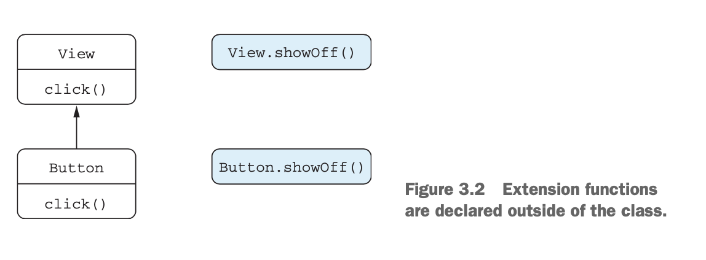
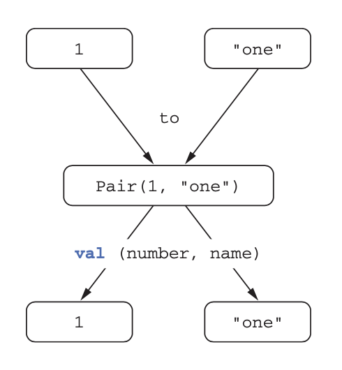

## 3.함수 정의와 호출

## 3.1 코틀린에서 컬렉션 만들기

```kotlin
val set = hashSetOf(1, 7, 53) 
val list = arrayListOf(1, 7, 53) 
val map = hashMapOf(1 to "one", 7 to "seven", 53 to "fifty-three")

//(javaClass 는 자바 getClass()에 해당하는 코틀린 코드다.)

println(set.javaClass)
//  class java.util.HashSet
println(list.javaClass)
//  class java.util.ArrayList
println(map.javaClass)
//  class java.util.HashMap
---------------------------------------------
val strings = listOf("first", "second", "fourteenth")
println(strings.last())
// fourteenth
val numbers = setrOf(1, 14, 2)
println(numbers.max())
// 14
```
- 자바와 같은 컬렉션을 사용한다.
- 표쥰 저버 콜래션울 활용하면 자바 코드와 상호작용하기가 훨씬 쉽다.
- 코틀린 함수를 호출하거나 코틀린에서 자바 함수를 호출할 때 자바와 코틀린 컬렉션을 서로 변화할 필요가 없다.

## 3.2 함수를 호출하기 쉽게 만들기

```kotlin
fun <T> joinToString(
        collection: Collection<T>,
        separator: String,
        prefix: String,
        postfix: String
): String {
    val result = StringBuilder(prefix)
    for ((index, element) in collection.withIndex()) {
        if (index > 0) result.append(separator)
        result.append(element)
}
    result.append(postfix)
    return result.toString()
}
------------------------------------------------------
val list = listOf(1, 2, 3)
println(joinToString(list, "; ", "(", ")")) 
// (1; 2; 3)
```
## 3.2.1 이름 붙인 인자
```kotlin
joinToString(collection, "", "", ".")
```
- 인자로 전달하는 각 문자열이 어떤 역할을 하는지 구분하기는 어렵다.
- 이런 문제는 플래그 값을 전달해야 하는 경우 흔히 발생한다.
- 보통 자바에서는 eum 타입을 사용하라고 권장하지만 일부 코딩 스타일에서는 주석으로 처리한다.
```java
joinToString(collection, /*separator*/ "", /*prefix*/ "", /*postfix*/ ".")
```
- 코틀린에서는 이 문제를 아래와 같이 사용할 수 있다.
- 디폴트 파라미터 값과 함께 사용할 때 쓸모가 많다.
```kotlin
joinToString(collection, separator = "", prefix = "", postfix = ".")
```
## 3.2.2 디폴트 파라미터 값
```kotlin
fun <T> joinToString(
    collection: Collection<T>,    
    separator: String = ", ",     
    prefix: String = "",          
    postfix: String = ""          
): String {
    ...
}
val list = listOf(1, 2, 3) 
joinToString(list, ", ", "", ".")                // 1, 2, 3 
joinToString(list)                               // 1, 2, 3 
joinToString(list, "; ")                         // 1; 2; 3
joinToString(list, prefix = ";", postfix = "# ") // # 1, 2, 3;
```
- 함수 선언시 파라미터에 디폴트 값을 설정할 수 있다.
- 디폴트 값을 사용함으로 오러로딩의 필요성이 줄어든다.
- 
## 3.2.3 정적인 유틸리티 클래스 없애기: 최상위 함수와 프로퍼티
### 최상위 함수
- 함수를 직접 소스 파일의 최상위 수준, 클래스 밖에 위치시킬 수 있다. 
- JVM이 클래스 안에 들어있는 코드만을 실행할 수 있기 때문에, 컴파일할 때 새로운 클래스를 정의해준다.
```kotlin
package strings;
public class JoinKt { //join.kt -> 코틀린 소스 파일 이름과 자바 클래스 이름이 대응된다.
    public static String joinToString(...) { ... }
}
```
### 최상위 프로퍼티
- 프로퍼티도 최상위 수준에 놓을 수 있다.
- -> 정적 필드에 저장된다.
```kotlin
var opCount = 0
fun performOperation() {
    opCount++
    // ...
}
fun reportOperationCount() {
    println("Operation performed $opCount times")
}
```
- 최상위 프로퍼티를 활용해 코드에 상수를 추가할 수 있다.
```kotlin
val UNIX_LINE_SEPARATOR = "\n"
```
- 최상위 프로퍼티도 다른 프로퍼티처럼 접근자 메서드를 통해 자바 코드에 노출된다.
- const 변경자를 추가하면 프로퍼티를 public static final 필드로 컴파일하게 만들 수 있다.
  (primitive 타입과 String 타입만 const로 지정할 수 있다.)


## 3.3 확장 함수와 확장 프로퍼티
- 확장 함수는 어떤 클래스의 멤버 메서드인 것처럼 호출할 수 있지만, 그 클래스의 밖에 선언된 함수다.

- 수신 객체 타입(receiver type): 클래스 이름
- 수신 객체(receiver object): 확장 함수가 호출되는 대상이 되는 값(객체)
- 확장 함수를 사용하기 위해서는 import해야 한다.
```kotlin
import strings.lastChar
val c = "Kotlin".lastChar()
import strings.lastChar as last //as 키워드를 사용하면 다른 이름으로 부를 수 있다.
val c = "Kotlin".last()
```
- 자바에서 확장 함수 호출 내부적으로 확장 함수는 수신 객체를 첫 번째 인자로 받는 정적 메소드이다.
```kotlin
char c = StringUtilKt.lastChar("Java");
```
## 3.3.4 확장 함수는 오버라이드할 수 없다.
- 수신 객체로 지정한 변수의 정적 타입에 의해 어떤 확장 함수가 호출될지 결정된다.

- 클래스의 멤버 함수 중 확장 함수와 이름 및 시그니처가 같은 함수가 있다면, 멤버 함수가 호출된다.
- 멤버 함수의 우선순위가 더 높다.

## 3.3.5 확장 프로퍼티
```kotlin
val String.lastChar: Char
  get() = get(length - 1)
```
- 뒷받침하는 필드(Backing field)가 없어서 기본 Getter 구현을 제공할 수 없으므로, 최소한 Getter는 꼭 정의해야 한다.
- 초기화 코드에서 계산한 값을 담을 장소가 없으므로, 초기화 코드도 쓸 수 없다.
```kotlin
var StringBuilder.lastChar: Char
    get() = get(length - 1)
    set(value: Char) {
        this.setCharAt(length - 1, value) //실제로 확장 프로퍼티는 아무 상태도 가질 수 없다.
    }
```
## 3.4.2 가변 인자 함수
```kotlin
fun listOf<T>(vararg values: T): List<T> { ... }
```
- 코틀린에서는 배열을 명시적으로 풀어서 배열의 각 원소가 인자로 전달되게 해야 한다.
```kotlin
fun main(args: Array<String>) {
    val list = listOf("args: ", *args) //스프레드 연산자(*)를 붙이면 배열의 내용을 펼쳐준다.
    println(list)
}
```

## 3.4.3 값의 쌍
- 인자가 하나뿐인 메서드나 확장 함수에 중위 호출을 사용할 수 있다.
- 수신 객체와 유일한 메서드 인자 사이에 메서드 이름을 넣어 호출한다.
- infix를 함수 선언 앞에 붙여서, 중위 호출을 허용할 수 있다.
```kotlin
infix fun Any.to(other: Any) = Pair(this, other)
1.to("one") //일반적인 방식의 호출
1 to "one" //중위 호출
```
```kotlin
val (number, name) = 1 to "one" //두 변수를 즉시 초기화할 수 있다.
```

- 루프에서도 구조 분해 선언을 활용할 수 있다.
```kotlin
for ((index, element) in collection.withIndex()) {
    println("$index: $element")
}
```

## 3.5 문자열
### 3중 따옴표 (""")
- 3중 따옴표 안에서는 역슬래시를 포함한 어떤 문자도 이스케이프할 필요가 없다.
- 줄바꿈을 표현하는 아무 문자열이나 그대로 들어간다.

## 3.6 로컬 함수
- 함수에서 추출한 함수를 원 함수 내부에 중첩시킬 수 있다.
- 로컬 함수는 자신이 속한 바깥 함수의 모든 파라미터와 변수를 사용할 수 있다.
```kotlin
class User(val id: Int, val name: String, val address: String)
fun User.validateBeforeSave() {
    fun validate(value: String, fieldName: String) {
        if (value.isEmpty()) {
            throw IllegalArgumentException(
               "Can't save user $id: empty $fieldName")
        }
    }

    validate(name, "Name")
    validate(address, "Address")
}
fun saveUser(user: User) {
    user.validateBeforeSave()
    // Save user to the database
}
```
- 한 객체만을 다루면서 객체의 비공개 데이터를 다룰 필요는 없는 함수는 확장 함수로 만들면 객체.멤버처럼 수신 객체를 지정하지 않고도 공개된 멤버 프로퍼티나 메서드에 접근할 수 있다