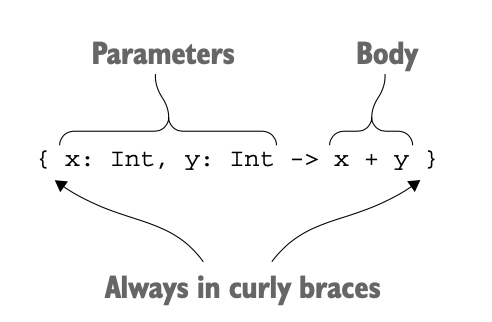
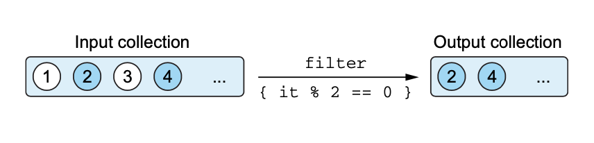
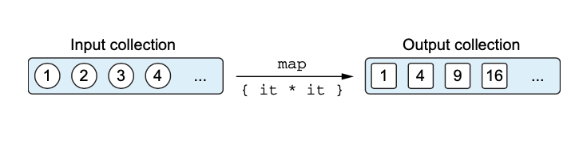
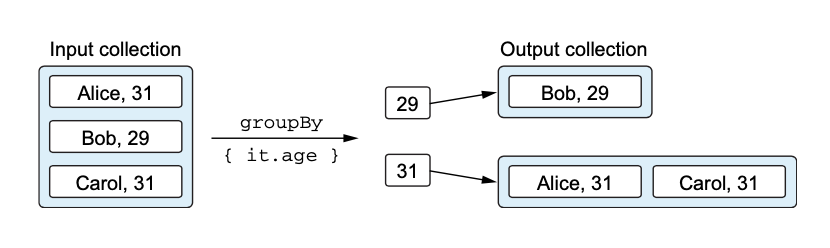
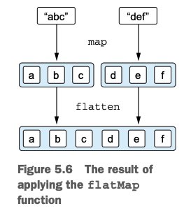

# 람다로 프로그래밍

- 람다 식(lambda expression) 또는 람다는 기본적으로 다른 함수에 넘길 수 있는 작은 코드 조각을 뜻한다.
- 람다를 사용하면 쉽게 공통 코드 구조를 라이브러리 함수로 뽑아 낼 수 있다.

## 람다: 코드 블럭을 함수 인자로 넘기기
- 람다 식을 사용하면 함수를 선언할 필요가 없고, 코드 블럭을 직접 함수의 인자로 전달 할 수 있다.
- 람다를 메서드가 하나뿐인 무명 객체를 대신 사용할 수 있다.
```kotlin
button.setOnClickListener{/* 클릭 시 수행할 동작*/}
```

## 람다와 컬렉션
- maxBy : 컬렉션에 특정 조건을 기준으로 가장 큰원소를 찾아 반환하는 함수
- 함수나 프로퍼티를 반환하는 역할을 수행하는 람다는 멤버 참조로 대치 할 수 있다.
```kotlin
val people = listOf(Person("Alice", 29), Person("Bob", 31))
println(people.maxBy {it.age})

//>> Person(name = Bob, age = 31)

------------------------------------------------------------

people.maxBy(Person::age)
```
## 람다 식의 문법
- 람다는 값처럼 여기저기 전달할 수 있는 동작의 모듬이다.
- 변수에 저장할 수도 있다.
- 함수에 인자로 넘기면서 바로 람다를 정의하는 경우가 대부분이다.
  
- 코틀린에서는 함수 호출 시 맨 뒤에 있는 인자가 람다 식이면 그 람다를 괄호 밖으로 빼낼 수 있다.
- 람다가 어떤 함수의 유일한 인자이고 괄호 뒤에 람다를 썼다면, 호풀 시 괄호를 없애도 된다.
```kotlin
people.maxBy({ p: Person -> p.age })
people.maxBy() { p: Person -> p.age }
people.maxBy { p: Person -> p.age }
```
- 인자가 여럿 있는 경우에는 람다를 밖으로 빼낼 수도 있고 람다를 괄호 안에 유지해서 함수의 인자임을 분명히 할 수도 있다. 
- 둘 이상의 람다를 인자로 받는 경우 괄호를 사용하는 일반적인 함수 호출 구문을 사용하는 편이 낫다. 
- 람다의 파라미터가 하나뿐이고 그 타입을 컴파일러가 추론할 수 있는 경우 it을 바로 쓸 수 있다.
```kotlin
people.maxBy { it.age }
```
- 람다 안에 람다가 중첩되는 경우 각 람다의 파라미터를 명시하는 편이 낫다. 
- 람다를 변수에 저장할 때는 파라미터 타입을 명시해야 한다.
```kotlin
val getAge = { p: Person -> p.age }
```
- 본문이 여러 줄로 이뤄진 경우 본문의 맨 마지막에 있는 값이 람다의 결과 값이 된다.

## 현재 영역에 있는 변수로 접근
- 람다를 함수 안에서 정의하면 함수의 파라미터뿐 아니라 람다 정의의 앞에 선언된 로컬 변수까지 람다에서 모두 사용할 수 있다.
- 파이널 변수가 아닌 변수에 접근할 수 있고, 바깥의 변수를 변경할 수 있다.
```kotlin
fun printProblemCounts(responses: Collection<String>) {    var clientErrors = 0 //람다에서 사용할 변수 선언
    var serverErrors = 0
    responses.forEach {
        if (it.startsWith("4")) {
            clientErrors++ //람다 안에서 람다 밖의 변수를 변경한다.
        } else if (it.startsWith("5")) {
            serverErrors++
        }
    }
    println("$clientErrors client errors, $serverErrors server errors")
}
```
- 람다 안에서 사용하는 외부 변수를 '람다가 포획한 변수(captured variable)'라고 부른다.
- 어떤 함수가 자신의 로컬 변수를 포획한 람다를 반환하거나 다른 변수에 저장한다면 로컬 변수의 생명주기와 함수의 생명주기가 달라질 수 있다.
  - 파이널 변수를 포획한 경우: 람다 코드를 변수 값과 함께 저장
  - 파이널이 아닌 변수를 포획한 경우: 변수를 특별한 래퍼로 감싸서 래퍼에 대한 참조를  람다 코드와 함께 저장한다.

## 맴버 참조
- 코틀린에서는 자바 8과 마찬가지로 함수를 값으로 바꿀 수 있다.
- ::을 사용하는 식을 멤버 참조라고 부른다.
- 프로퍼티나 메서드를 단 하나만 호출하는 함수 값을 만들어준다.
- 그 멤버를 호출하는 람다와 같은 타입이다.
- 최상위에 선언된 함수나 프로퍼티를 참조할 수도 있다.
```kotlin
val getAge = Person::age
```

## 컬렉션 함수형 API

## filter 와 map
- filter: 컬렉션을 이터레이션하면서 주어진 람다에 각 원소를 넘겨 람다가 true를 반환하는 원소만 모은다. (‘새로운 컬렉션’을 반환한다.)
```kotlin
val list = listOf(1, 2, 3, 4)
println(list.filter{ it % 2 == 0})
// [2, 4] 
```

- map: 주어진 람다를 컬렉션의 각 원소에 적용한 결과를 모아서 ‘새 컬렉션’을 만든다.
```kotlin
val list = listOf(1, 2, 3, 4)
println(list.map{it * it})
// [1, 4, 9, 16]
```


## all, any, count, find: 컬렉션에 술어 적용
- all: 모든 원소가 어떤 조건을 만족하는지 판단
- any: 어떤 조건을 만족하는 원소가 있는지 판단
- count: 조건을 만족하는 원소의 개수 반환
- find: 조건을 만족하는 ‘첫 번째’ 원소 반환 (firstOrNull과 같다)

- 어떤 조건에 대해 !all을 수행하는 결과와 그 조건의 부정에 대해 any를 수행한 결과는 같다.(->드 모르강의 법칙)
- 가독성을 위해 any와 all 앞에 !를 붙이지 않는 것이 낫다.

## groupBy: 리스트를 여러 그룹으로 이뤄진 맵으로 변경
- 각 그룹은 리스트이다. 예시에서의 groupBy의 결과 타입은 Map<Int, List>이다.


## flatMap과 flatten: 중첩된 컬렉션의 안의 원소 처리 
- flatMap: 주어진 람다를 컬렉션의 모든 객체에 적용(map)하고, 적용한 결과 얻어지는 여러 리스트를 한 리스트에 모은다(flatten).
- flatten: 특별히 변환할 내용없이 펼치기만 할 때 사용
  - list.flatten()
```kotlin
val strings = listOf("abc", "def")
println(strings.flatMap{ it.toList() })
// [a, b, c, d, e, f]

-----------------------------------------
val book = listOf(Book("Thursday Next", listOf("Jasper Fforde")),
                  Book("Mort", listOf("Terry Pratchett")),
                  Book("Good Omens", listOf("Terry Pratchett", "Neil Gaiman")),
                  )
println(book.flatMap { it.authors }.toSet() )
// [Jasper Fforde, "Terry Pratchett", "Neil Gaiman"]
```


## 지연 계산(lazy) 컬렉션 연산
```kotlin
people.map(Person::name).filter { it.startsWith("A") }
```
- map이나 filter와 같은 컬렉션 함수는 결과 컬렉션을 즉시 생성한다.
```kotlin
people.asSequence() //컬렉션을 시퀀스로 변환한다.
    .map(Person::name) //시퀀스도 컬렉션과 똑같은 API를 제공한다.
    .filter { it.startsWith("A") }
    .toList() //결과 시퀀스를 다시 리스트로 변환한다.
```
- 시퀀스를 사용하면 중간 임시 컬렉션을 사용하지 않고도 컬렉션 연산을 연쇄할 수 있다.
- 지연 계산 시퀀스는 Sequence 인터페이스에서 시작한다.
- 시퀀스는 한 번에 하나씩 열거될 수 있는 원소의 시퀀스를 표현한다.
- Sequence에서 제공하는 iterator 메서드를 통해 시퀀스로부터 원소를 얻을 수 있다.
- 시퀀스는 지연 계산을 하기 때문에 최종 시퀀스의 원소를 하나씩 이터레이션하거나 최종 시퀀스를 리스트로 변환해야 한다.

## 자바 함수형 인터페이스 활용
- 추상 메서드가 단 하나만 있는 인터페이스를 함수형 인터페이스 / SAM(Single Abstract Method) 인터페이스 라 하고 단일 추상 메서드라는 뜻을 같는다.

## 자바 메서드에 람다를 인자로 전달
- 함수형 인터페이스를 인자로 원하는 자바 메서드에 코틀린 람다를 전달할 수 있다.

```kotlin
postponeComputation(1000) { println(42) }
```
- 컴파일러는 자동으로 무명 클래스와 인스턴스를 만들어준다.
- 람다와 무명 객체의 차이
  - 객체: 명시적으로 선언하는 경우, 메서드를 호출할 때마다 새로운 객체가 생성된다.
  - 람다: 람다에 대응하는 무명 객체를 메서드 호출 시마다 반복 사용한다.
- 람다가 주변 영역의 변수를 포획한다면 컴파일러는 매번 주변 영역의 변수를 포획한 새로운 인스턴스를 생성해준다.

## 수신 객체 지정 람다: with와 apply
- 수신 객체를 명시하지 않고 람다의 본문 안에서 다른 객체의 메서드를 호출할 수 있게 하는 람다

### with 함수
- with가 반환하는 값은 람다 코드를 실행한 결과이다.
```kotlin
fun alphabet(): String {
    val stringBuilder = StringBuilder()
    return with(stringBuilder) { //메서드를 호출하려는 수신 객체를 지정한다.
        for (letter in 'A'..'Z') {
            this.append(letter) //this를 명시하여 수신 객체의 메서드를 호출한다.
        }
        append("\nNow I know the alphabet!") //this는 생략 가능하다.
        this.toString()
    }
}
```
- with 함수는 첫 번째 인자로 받은 객체를 두 번째 인자로 받은 람다의 수신 객체로 만든다.
```kotlin
fun alphabet() = with(StringBuilder()) {
    for (letter in 'A'..'Z') {
        append(letter)
    }
    append("\nNow I know the alphabet!")
    toString()
}
```
- 불필요한 stringBuilder 변수를 없애면 alphabet() 함수가 식의 결과를 바로 반환하게 된다.

### apply 함수
- apply는 항상 수신 객체를 반환한다.
- apply의 수신 객체가 전달받은 람다의 수신 객체가 된다.

- 객체의 인스턴스를 만들면서 즉시 프로퍼티 중 일부를 초기화해야 하는 경우 유용하다.
```kotlin
fun alphabet() = StringBuilder().apply {
    for (letter in 'A'..'Z') {
        append(letter)
    }
    append("\nNow I know the alphabet!")
}.toString()
```


